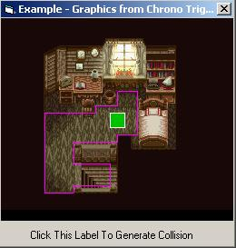



## Collision Detection\(pixel precise\) with test and example projects \+ documentation\(updated\)

### Description

Detect collision between an object and user defined borders of movement.
 
### More Info
 

             |
---                |---
**Submitted On**   |2005-05-22 11:06:56
**By**             |[Gex](https://github.com/Planet-Source-Code/PSCIndex/blob/master/ByAuthor/gex.md)
**Level**          |Intermediate
**User Rating**    |4.2 (21 globes from 5 users)
**Compatibility**  |VB 6\.0
**Category**       |[Games](https://github.com/Planet-Source-Code/PSCIndex/blob/master/ByCategory/games__1-38.md)
**World**          |[Visual Basic](https://github.com/Planet-Source-Code/PSCIndex/blob/master/ByWorld/visual-basic.md)
**Archive File**   |[Collision\_1890745222005\.zip](https://github.com/Planet-Source-Code/gex-collision-detection-pixel-precise-with-test-and-example-projects-documentation-updated__1-60626/archive/master.zip)

### Source Code

Download the .zip file containing all you need. Feel free to add magenta collored lines to the 'example project' but make sure they are arrays of line1. Select any magenta collored line, press Ctrl+C, then press Ctrl+V and then change positions of the line pasted.

